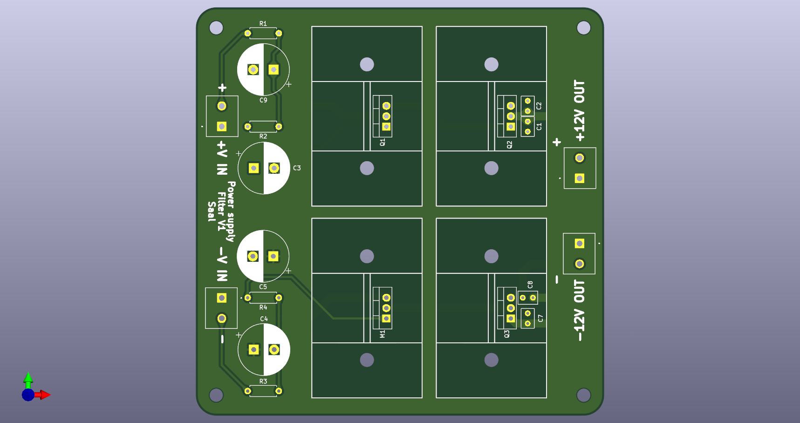

# Simple and Cost Effective Low Ripple Power Filter
---

A Ripple filter for the power supply of a modular **Analog Computer** in Eurorack format. The design goal is to be simple in part count and assembly while being cost effective and maintaining low ripple output.\
The filter is designed for a **+15V/-15V input power supply** and a **+12V/-12V output**.

The filter is devided into two parts, for the positive and negative supply voltage. In a first step the voltage is filteres in a **capacitance multiplier**, supplied by a second order **RC low-pass filter**. The output is then put through a second stage a **linear voltage regulator**. In simulations in *falstadts online circuit simulator* and *LTSpice*, the resulting output voltage should have a **voltage ripple in the lower mV range**, depending on the input powwer supply.

For an explaination on how a capacitance multiplier works, see [1].

---
## PCB render

---
## Schematic

Schematic if the power supply filter. \
As a first step the power is routed through a capacitance multiplier with a second order RC low pass filter. The corner frequency here is set to around 10 Hz.

---
## Components

**<u>Darlingtons:</u>**\
[MJF122G](https://www.digikey.de/de/products/detail/onsemi/MJF122G/919531) \
[MJF127G](https://www.digikey.de/de/products/detail/onsemi/MJF127G/919532)

**<u>Linear Regulators:</u>**\
12V 3A:\
[MIC29300-12WT](https://www.digikey.de/de/products/detail/microchip-technology/MIC29300-12WT/771587)

-12V 1.5A:\
[LM7912CT/NOPB](https://www.digikey.de/de/products/detail/texas-instruments/LM7912CT-NOPB/6355)

-12V 1.8A:\
[LM2990T-12/NOPB](https://www.digikey.de/de/products/detail/texas-instruments/LM2990T-12-NOPB/182373)

12V 1.5A:\
[LM340T-12/NOPB](https://www.digikey.de/de/products/detail/texas-instruments/LM340T-12-NOPB/6233)

**<u>TO-220 Heatsinks:</u>**\
[Boyd Laconia 513002B02500G](https://www.digikey.de/de/products/detail/boyd-laconia-llc/513002B02500G/1625590?s=N4IgTCBcDaIKwEYDMAGFYBC65oOIgF0BfIA)\
[Boyd Laconia 530002B02500G](https://www.digikey.de/de/products/detail/boyd-laconia-llc/530002B02500G/1216384)\
[Boyd Laconia 529802B02500G](https://www.digikey.de/de/products/detail/boyd-laconia-llc/529802B02500G/1216357)

**<u>Isolator:</u>**\
[THERM PAD](https://www.digikey.de/de/products/detail/boyd-laconia-llc/56-77-11G/1625385)

**<u>Screws:</u>**\
[M3,5x0,6 Nylon](https://www.digikey.de/de/products/detail/essentra-components/50M035060D012/11639017)\
[M3,5 Nut Nylon](https://www.digikey.de/de/products/detail/essentra-components/04M035060HN/9677097)

**<u>Base Power supply:</u>**\
[PD-2515](https://www.digikey.de/de/products/detail/mean-well-usa-inc/PD-2515/7705635)

**<u>Filter Capacitors:</u>**\
[UBY2A161MHL](https://www.digikey.de/de/products/detail/nichicon/UBY2A161MHL/9452708)
[0.22u CL31B224KBFNNNE](https://www.digikey.de/de/products/detail/samsung-electro-mechanics/CL31B224KBFNNNE/3886764)
[0.1u 1206B104K500CT](https://www.digikey.de/de/products/detail/walsin-technology-corporation/1206B104K500CT/9355102)

**<u>Output Linear Regulator Capacitors:</u>**\
[2.2u Typ1](https://www.digikey.de/de/products/detail/kemet/C320C225K5N5TA91707301/14318938)\
[1u Type1](https://www.digikey.de/de/products/detail/kemet/C320C105K5N5TA/14681443)\
[2.2u Type2](https://www.digikey.de/de/products/detail/tdk-corporation/FA14X7R1H225KRU06/5865806)\
[1u Type2](https://www.digikey.de/de/products/detail/tdk-corporation/FG18X5R1H105KRT06/5802871)

**<u>Filter Resistor:</u>**\
[MFR50SFTE52-100R](https://www.digikey.de/de/products/detail/yageo/MFR50SFTE52-100R/9151030)

---
## Sources

 [1] [capacitance Multiplier](https://sound-au.com/articles/cap-multiplier.htm
)
