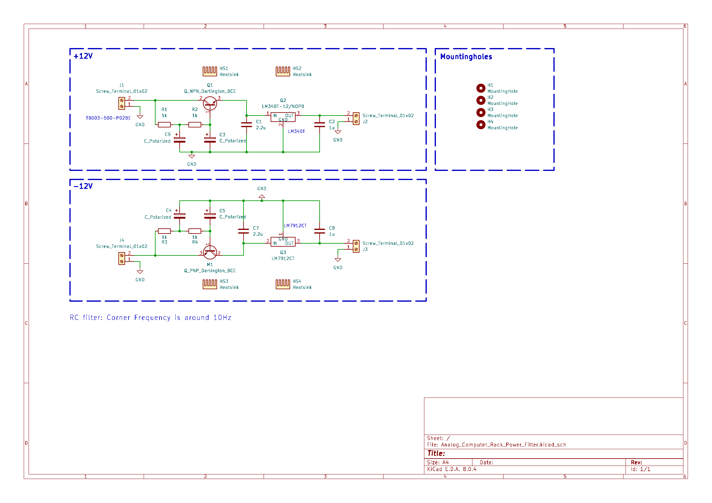

# Analog_Computer_Rack_Power_Filter
---

Ripple filter for the power supply of a Analog Computer.

First capacitance multiplier,
then LDO regulator.

How does a capacitance multiplier work:
https://sound-au.com/articles/cap-multiplier.htm
This site, even has a dual power supply with negative voltages.

---
# Schematic

Schematic if the power supply filter. \
As a first step the power is routed through a capacitance multiplier with a second order RC low pass filter. The corner frequency here is set to around 10 Hz.

---
# Components

Darlingtons:
https://www.digikey.de/de/products/detail/onsemi/MJF122G/919531
https://www.digikey.de/de/products/detail/onsemi/MJF127G/919532

12V 3A:
https://www.digikey.de/de/products/detail/microchip-technology/MIC29300-12WT/771587

-12V 1.5A:
https://www.digikey.de/de/products/detail/texas-instruments/LM7912CT-NOPB/6355

-12V 1.8A:
https://www.digikey.de/de/products/detail/texas-instruments/LM2990T-12-NOPB/182373

12V 1.5A:
https://www.digikey.de/de/products/detail/texas-instruments/LM340T-12-NOPB/6233

TO-220 Kühler:
https://www.digikey.de/de/products/detail/boyd-laconia-llc/513002B02500G/1625590?s=N4IgTCBcDaIKwEYDMAGFYBC65oOIgF0BfIA
https://www.digikey.de/de/products/detail/boyd-laconia-llc/530002B02500G/1216384
https://www.digikey.de/de/products/detail/boyd-laconia-llc/529802B02500G/1216357

Isolator:
https://www.digikey.de/de/products/detail/boyd-laconia-llc/56-77-11G/1625385

Screws:
https://www.digikey.de/de/products/detail/essentra-components/50M035060D012/11639017
https://www.digikey.de/de/products/detail/essentra-components/04M035060HN/9677097
